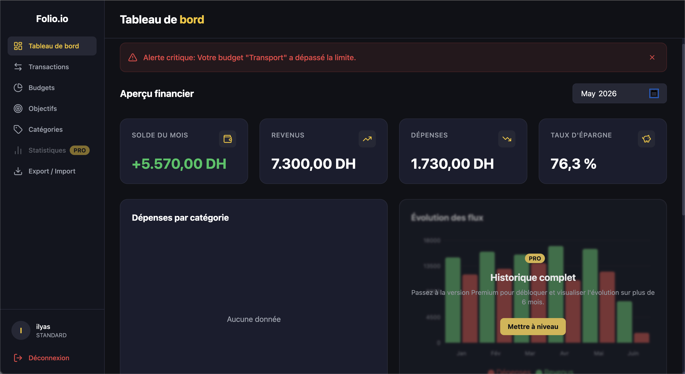
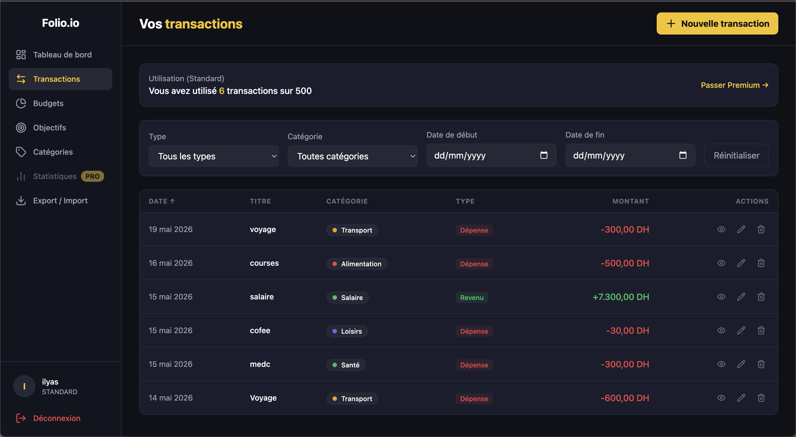
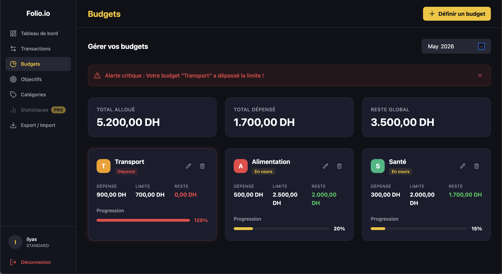

# Folio.io — Portefeuille Intelligent

> A full-stack personal finance management application built with Spring Boot and React.

---

## Table of Contents

- [Overview](#overview)
- [Features](#features)
- [Tech Stack](#tech-stack)
- [Project Structure](#project-structure)
- [Getting Started](#getting-started)
  - [Prerequisites](#prerequisites)
  - [Environment Variables](#environment-variables)
  - [Running with Docker](#running-with-docker)
  - [Running Locally (Dev Mode)](#running-locally-dev-mode)
- [Architecture](#architecture)
  - [Backend](#backend)
  - [Frontend](#frontend)
  - [Database Schema](#database-schema)
- [API Reference](#api-reference)
- [Authentication & Security](#authentication--security)
- [User Roles](#user-roles)
- [Running Tests](#running-tests)
- [Screenshots](#screenshots)

---

## Overview

Folio.io is a personal finance tracker that lets users manage transactions, set monthly budgets, track savings goals, and visualize their spending habits through an interactive dashboard. It supports a freemium model with **Standard** and **Premium** user tiers.

---

## Features

| Feature                       | Standard       | Premium      |
| ----------------------------- | -------------- | ------------ |
| Transaction management (CRUD) | ✅ (up to 500) | ✅ Unlimited |
| Custom categories             | ✅ (up to 10)  | ✅ Unlimited |
| Monthly budgets with alerts   | ✅             | ✅           |
| Savings goals                 | ✅ (1 active)  | ✅ Unlimited |
| Dashboard KPIs                | ✅             | ✅           |
| Spending pie chart            | ✅             | ✅           |
| Revenue/expenses history      | ❌             | ✅           |
| CSV export                    | ✅             | ✅           |

### Core Modules

- **Authentication** — Register, login, logout via HttpOnly JWT cookies. Token blacklist on logout, rate limiting on auth endpoints.
- **Transactions** — Full CRUD with soft-delete, pagination, and filtering by date range, type, category, and keyword.
- **Categories** — System-seeded categories per user on registration, plus custom categories. Role-based creation limits.
- **Budgets** — Monthly budgets per category with configurable alert thresholds (WARNING / CRITICAL).
- **Goals** — Savings goals with contribution history and milestone tracking (25 / 50 / 75 / 100 %).
- **Dashboard** — Real-time KPIs (balance, income, expenses, savings rate) and spending breakdown chart.
- **Export** — Download all transactions as a CSV file.

---

## Tech Stack

### Backend

- **Java 17** + **Spring Boot 3.5**
- **Spring Security** — stateless JWT authentication
- **Spring Data JPA** + **Hibernate** — ORM with PostgreSQL dialect
- **Flyway** — database migrations
- **JJWT 0.12.6** — JWT token generation and validation
- **Bucket4j 8.18** — in-memory rate limiting per IP
- **Lombok** — boilerplate reduction
- **PostgreSQL 15** — primary database

### Frontend

- **React 19** + **TypeScript** + **Vite 8**
- **Tailwind CSS 4** — utility-first styling with custom design tokens
- **React Router 7** — client-side routing
- **React Hook Form** — form state management and validation
- **Axios** — HTTP client with response interceptors
- **Recharts** — charts (pie chart, bar chart)
- **Lucide React** — icon library

### Infrastructure

- **Docker** + **Docker Compose** — containerised development environment

### Testing

- **Backend**: JUnit 5, Mockito, Spring MockMvc (`@WebMvcTest`)
- **Frontend**: Vitest, Testing Library (React + user-event), jsdom

---

## Project Structure

```
folio.io/
├── backend/                        # Spring Boot application
│   ├── src/main/java/com/gc2026/portfolio/
│   │   ├── config/                 # CORS, Security configuration
│   │   ├── controller/             # REST controllers
│   │   ├── domain/
│   │   │   ├── entity/             # JPA entities
│   │   │   ├── enums/              # TransactionType, UserRole, GoalStatus, …
│   │   │   └── exception/          # Custom exceptions + GlobalExceptionHandler
│   │   ├── dto/
│   │   │   ├── request/            # @Valid request DTOs
│   │   │   └── response/           # Response DTOs
│   │   ├── repository/             # Spring Data JPA repositories
│   │   ├── security/               # JwtFilter, JwtUtil, TokenBlacklist, RateLimitFilter
│   │   └── service/                # Business logic
│   ├── src/main/resources/
│   │   ├── application.properties
│   │   └── db/migration/           # Flyway SQL migrations (V1, V2, …)
│   ├── src/test/                   # Unit + slice tests
│   ├── Dockerfile
│   └── pom.xml
│
├── frontend/                       # React + Vite application
│   ├── src/
│   │   ├── api/                    # Axios API clients (authApi, transactionApi, …)
│   │   ├── components/
│   │   │   ├── budgets/            # BudgetCard, BudgetForm
│   │   │   ├── categories/         # CategoryList, CategoryForm
│   │   │   ├── charts/             # SpendingPieChart, RevenueExpensesBar
│   │   │   ├── goals/              # GoalCard, GoalForm, ContributeModal, …
│   │   │   ├── layout/             # AppShell, Sidebar, TopBar
│   │   │   ├── transactions/       # TransactionTable, TransactionForm, TransactionFilters
│   │   │   └── ui/                 # Shared: Badge, KpiCard, ProgressBar, ConfirmDialog, …
│   │   ├── context/                # AuthContext
│   │   ├── hooks/
│   │   │   ├── api/                # useTransactions, useBudgets, useGoals, useDashboard, …
│   │   │   ├── useAuth.ts
│   │   │   ├── useQuery.ts         # Generic data-fetching hook
│   │   │   └── useMutation.ts      # Generic mutation hook
│   │   ├── pages/                  # Route-level components
│   │   ├── types/                  # TypeScript interfaces
│   │   └── utils/                  # formatCurrency, formatDate
│   ├── Dockerfile
│   └── vite.config.ts
│
├── docker-compose.yml              # PostgreSQL dev database
├── .env.example                    # Environment variable template
└── README.md
```

---

## Getting Started

### Prerequisites

- **Docker** and **Docker Compose** (for the database)
- **Java 17+** and **Maven 3.9+** (for local backend dev)
- **Node.js 22+** and **npm** (for local frontend dev)

### Environment Variables

Copy `.env.example` to `.env` and fill in the values:

```bash
cp .env.example .env
```

```env
# Backend
JWT_SECRET=your-super-secret-key-min-32-chars-long
JWT_EXPIRATION_MS=86400000

SPRING_DATASOURCE_URL=jdbc:postgresql://localhost:5432/portfolio_db
SPRING_DATASOURCE_USERNAME=portfolio_user
SPRING_DATASOURCE_PASSWORD=your_db_password

# Frontend
VITE_API_BASE_URL=http://localhost:8080/api/v1
```

> ⚠️ `JWT_SECRET` must be **at least 32 characters** long for HS256 security.

### Running with Docker

Start only the PostgreSQL database via Docker Compose (the default dev setup):

```bash
docker-compose up -d
```

This starts a PostgreSQL 15 instance at `localhost:5432` with:

- Database: `portfolio_db`
- User: `portfolio_user`
- Password: `secret` (override in production)

### Running Locally (Dev Mode)

**1. Backend**

```bash
cd backend

# Set required env vars (or export them in your shell)
export JWT_SECRET="your-super-secret-key-min-32-chars-long"
export SPRING_DATASOURCE_PASSWORD="secret"

./mvnw spring-boot:run
```

The API starts at `http://localhost:8080`. Flyway will run migrations automatically.

**2. Frontend**

```bash
cd frontend
npm install
npm run dev
```

The app starts at `http://localhost:5173`. API calls are proxied to `:8080` via Vite's dev server.

---

## Architecture

### Backend

The backend follows a layered architecture:

```
HTTP Request
    ↓
RateLimitFilter  (Bucket4j — 10 req/min per IP on /auth/*)
    ↓
JwtFilter        (validates HttpOnly cookie, sets userId/userRole on request)
    ↓
Controller       (input validation via @Valid, delegates to service)
    ↓
Service          (business logic, IDOR checks, centimes arithmetic)
    ↓
Repository       (Spring Data JPA, custom JPQL queries)
    ↓
PostgreSQL
```

Key design decisions:

- **HttpOnly cookies** instead of localStorage tokens — prevents XSS token theft.
- **Token blacklist** in DB (`revoked_tokens` table) — supports immediate logout. Expired tokens are cleaned up nightly at 3 AM.
- **Soft delete** on transactions — `is_deleted` flag, never physically removed.
- **Amounts in centimes** (Long) — avoids floating-point rounding issues throughout the stack.
- **System categories** — seeded per user at registration (Salaire, Alimentation, Transport, etc.) and cannot be modified or deleted.

### Frontend

```
App.tsx (BrowserRouter + AuthProvider + ErrorBoundary)
    ↓
ProtectedRoute   (checks isAuthenticated, redirects to /login if not)
    ↓
AppShell         (Sidebar + <Outlet />)
    ↓
Pages            (Dashboard, Transactions, Budgets, Goals, Categories, Export)
```

Data layer pattern:

- **`useQuery(fetcher, deps)`** — generic hook for read operations (loading, error, data, refetch).
- **`useMutation(fn, options)`** — generic hook for write operations (loading, error, onSuccess callback).
- Domain-specific hooks (`useDashboard`, `useTransactions`, etc.) compose `useQuery` with the appropriate API function.

Currency handling:

- All amounts travel over the wire in **centimes** (integers).
- `toCentimes(input)` converts user input before API calls.
- `fromCentimes(centimes)` converts for form pre-population.
- `formatCurrency(centimes)` formats for display (e.g. `1 250,00 DH`).

### Database Schema

```
users
  └─< categories        (user_id FK, is_system flag)
  └─< transactions      (user_id FK, category_id FK, is_deleted soft-delete)
  └─< budgets           (user_id FK, category_id FK, unique per user+category+month)
  └─< goals             (user_id FK)
       └─< goal_contributions (goal_id FK)
revoked_tokens          (JWT blacklist, cleaned up nightly)
```

Migrations are managed by Flyway in `src/main/resources/db/migration/`.

---

## API Reference

All endpoints are prefixed with `/api/v1`. Authentication uses an `auth_token` HttpOnly cookie.

### Auth — `/api/v1/auth`

| Method | Path        | Auth | Description              |
| ------ | ----------- | ---- | ------------------------ |
| `POST` | `/register` | ❌   | Register a new user      |
| `POST` | `/login`    | ❌   | Login and receive cookie |
| `POST` | `/logout`   | ✅   | Invalidate token         |
| `GET`  | `/me`       | ✅   | Get current user profile |

### Transactions — `/api/v1/transactions`

| Method   | Path   | Description                                                                                              |
| -------- | ------ | -------------------------------------------------------------------------------------------------------- |
| `GET`    | `/`    | List with pagination & filters (`type`, `categoryId`, `startDate`, `endDate`, `keyword`, `page`, `size`) |
| `POST`   | `/`    | Create transaction                                                                                       |
| `GET`    | `/:id` | Get by ID                                                                                                |
| `PUT`    | `/:id` | Update                                                                                                   |
| `DELETE` | `/:id` | Soft-delete                                                                                              |

### Budgets — `/api/v1/budgets`

| Method   | Path            | Description                                        |
| -------- | --------------- | -------------------------------------------------- |
| `POST`   | `/`             | Create or update a budget (upsert)                 |
| `GET`    | `/:month`       | List budgets for a month (`YYYY-MM`) with progress |
| `GET`    | `/:id/progress` | Get budget progress                                |
| `DELETE` | `/:id`          | Delete a budget                                    |

### Goals — `/api/v1/goals`

| Method   | Path              | Description                 |
| -------- | ----------------- | --------------------------- |
| `POST`   | `/`               | Create a goal               |
| `GET`    | `/`               | List user goals             |
| `POST`   | `/:id/contribute` | Add a contribution          |
| `GET`    | `/:id/progress`   | Get progress and milestones |
| `DELETE` | `/:id`            | Delete a goal               |

### Categories — `/api/v1/categories`

| Method   | Path   | Description                                 |
| -------- | ------ | ------------------------------------------- |
| `GET`    | `/`    | List all categories for user                |
| `POST`   | `/`    | Create custom category                      |
| `PUT`    | `/:id` | Update custom category                      |
| `DELETE` | `/:id` | Delete custom category (if no transactions) |

### Dashboard — `/api/v1/dashboard`

| Method | Path                      | Description                             |
| ------ | ------------------------- | --------------------------------------- |
| `GET`  | `/kpis?month=YYYY-MM`     | Income, expenses, balance, savings rate |
| `GET`  | `/spending?month=YYYY-MM` | Top 8 spending categories + "Autre"     |

### Export — `/api/v1/export`

| Method | Path   | Description                      |
| ------ | ------ | -------------------------------- |
| `GET`  | `/csv` | Download all transactions as CSV |

---

## Authentication & Security

- **JWT** stored in an `HttpOnly; Secure; Path=/` cookie — not accessible from JavaScript.
- **Token blacklist** — on logout, the token is saved to the `revoked_tokens` table and checked on every request. Expired entries are cleaned up daily.
- **Rate limiting** — auth endpoints (`/api/v1/auth/*`) are capped at **10 requests per minute per IP** via Bucket4j. Exceeding this returns HTTP 429.
- **CORS** — configured to allow only `http://localhost:5173` in development.
- **Password hashing** — BCrypt with Spring Security's default cost factor.
- **IDOR protection** — every service method checks that the requested resource belongs to the authenticated user (`userId` extracted from JWT, passed through to repositories).
- **Global exception handler** — never exposes stack traces; maps custom exceptions to HTTP 400/401/404/500.

---

## User Roles

| Role       | Description                                                                                        |
| ---------- | -------------------------------------------------------------------------------------------------- |
| `STANDARD` | Default on registration. Limited to 500 transactions, 10 custom categories, 1 active goal.         |
| `PREMIUM`  | Unlocks unlimited transactions, categories, and goals. Enables historical charts and CSV export. |
| `ADMIN`    | Same privileges as PREMIUM.                                                                        |

Role is embedded in the JWT and read from the `userRole` request attribute by controllers and services.

---

## Running Tests

### Backend

```bash
cd backend
./mvnw test
```

The test suite includes:

- **Unit tests** for all services (AuthService, TransactionService, BudgetService, GoalService, CategoryService, DashboardService, ExportService)
- **Slice tests** (`@WebMvcTest`) for all controllers
- **Security tests** for JwtUtil, JwtFilter, RateLimitFilter, TokenBlacklist
- **Specification tests** for TransactionSpecification

### Frontend

```bash
cd frontend
npm test
# or for watch mode:
npm run test -- --watch
```

The test suite includes:

- Unit tests for utility functions (`formatCurrency`, `formatDate`)
- Hook tests for `useQuery` and `useMutation`
- Component tests for `ErrorBoundary`, `BudgetCard`, `GoalCard`, `TransactionForm`
- Context tests for `AuthContext`
- API layer tests for `authApi`, `transactionApi`, `goalApi`

---

## Screenshots

### Login


### Dashboard



### Transactions



### Budgets



### Goals


### Categories


### Export


