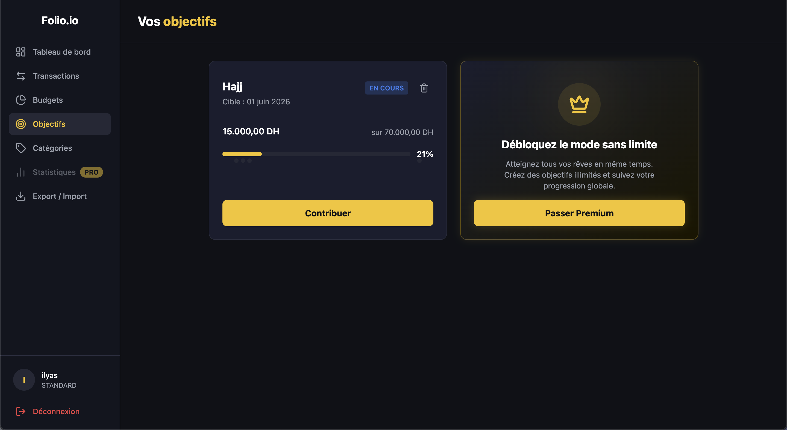
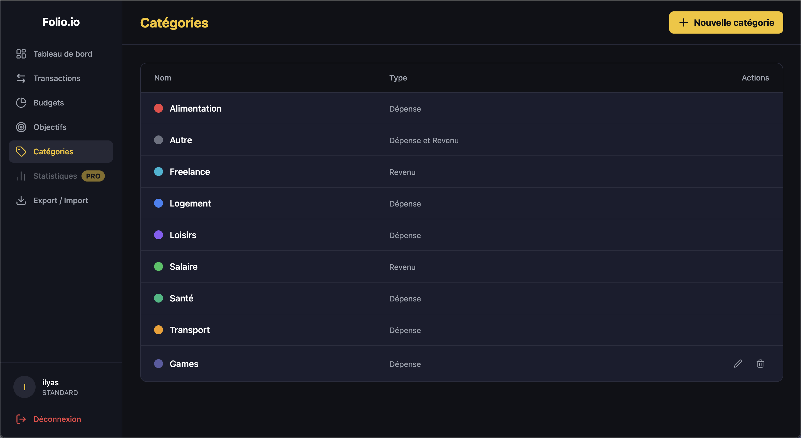

# Folio.io

> A full-stack personal finance management application — track transactions, set budgets, reach savings goals, and visualise your spending.

🌐 **Live demo:** [https://folio-ilyas.duckdns.org](https://folio-ilyas.duckdns.org)

---

## What it does

Folio.io is a freemium finance tracker with **Standard** and **Premium** tiers:

| Feature | Standard | Premium |
|---|---|---|
| Transaction management (CRUD) | ✅ up to 500 | ✅ Unlimited |
| Custom categories | ✅ up to 10 | ✅ Unlimited |
| Monthly budgets with alert thresholds | ✅ | ✅ |
| Savings goals with contribution history | ✅ 1 active | ✅ Unlimited |
| Dashboard KPIs & spending pie chart | ✅ | ✅ |
| Revenue / expenses history chart | ❌ | ✅ |
| CSV export | ✅ | ✅ |

**Core modules:** Auth (HttpOnly JWT cookies, rate-limited), Transactions (soft-delete, paginated filtering), Categories (system-seeded + custom), Budgets (WARNING/CRITICAL thresholds), Goals (milestone tracking at 25/50/75/100 %), Dashboard KPIs, CSV Export.

---

## Tech stack

| Layer | Technology |
|---|---|
| **Backend** | Java 17 · Spring Boot 3.5.0 · Spring Security · Spring Data JPA · Flyway · JJWT 0.12.6 · Bucket4j 8.18 |
| **Frontend** | React 19 · TypeScript · Vite 8 · Tailwind CSS 4 · React Router 7 · React Hook Form · Recharts · Axios |
| **Database** | PostgreSQL 15 |
| **Reverse proxy** | Caddy 2 (automatic HTTPS via Let's Encrypt) |
| **Container runtime** | Docker · Docker Compose |
| **CI/CD** | GitHub Actions · GitHub Container Registry (GHCR) · multi-arch images (amd64 + arm64) |
| **Observability** | Prometheus 3.0.1 · Loki 3.3.0 · Grafana 11.4.0 · Promtail · Node Exporter · cAdvisor |
| **Testing** | JUnit 5 · Mockito · Spring MockMvc · Vitest · Testing Library |

---

## Architecture at a glance

```
Browser (HTTPS)
    ↓
Caddy 2  ──  automatic TLS, single entry point on folio-ilyas.duckdns.org
    ├── /api/*      → backend:8080  (Spring Boot)
    ├── /grafana/*  → grafana:3000  (monitoring dashboards)
    └── /*          → frontend:80   (React SPA served by Nginx)

backend:8080 → postgres:5432 (PostgreSQL 15)
backend:8081 → Prometheus     (Spring Actuator metrics endpoint)

Observability sidecar: Prometheus + Node Exporter + cAdvisor + Loki + Promtail + Grafana
```

All services run on a private Docker bridge network; only Caddy ports 80/443 are exposed to the internet.

→ Full diagram and request-flow breakdown: [docs/architecture.md](docs/architecture.md)

---

## CI/CD

Every push to `main` triggers a fully automated pipeline:

1. **Test** — backend (JUnit/Spring against an ephemeral Postgres 15 container) and frontend (Vitest + ESLint) run in parallel.
2. **Build & push** — multi-platform Docker images (`linux/amd64` + `linux/arm64`) are built and pushed to GHCR, tagged with the Git SHA and `latest`.
3. **Deploy** — SSH into the production VPS, pull new images, and restart the stack with `docker-compose.prod.yml` + `docker-compose.observability.yml`. This stage is **gated by a manual approval** via a GitHub Environment (`production`) before it runs.

→ Full pipeline breakdown and rollback runbook: [docs/deployment.md](docs/deployment.md)

---

## Local setup (quickstart)

```bash
# 1. Copy env template and fill in JWT_SECRET + SPRING_DATASOURCE_PASSWORD
cp .env.example .env

# 2. Start the full stack (Postgres + backend + frontend)
docker compose up -d

# Frontend → http://localhost:80
# Backend  → http://localhost:8080
```

**Hot-reload dev flow** (frontend Vite HMR + Spring Boot DevTools):

```bash
# Terminal 1 — database only
docker compose up -d postgres

# Terminal 2 — backend
cd backend
export JWT_SECRET="your-32-char-secret"
export SPRING_DATASOURCE_PASSWORD="your_password"
./mvnw spring-boot:run   # http://localhost:8080

# Terminal 3 — frontend
cd frontend
npm install && npm run dev   # http://localhost:5173 (proxied to :8080)
```

→ Full prerequisites, env variables, and verification steps: [docs/setup.md](docs/setup.md)

---

## Observability

Production ships with a full monitoring sidecar: **Prometheus** (metrics) + **Loki/Promtail** (logs) + **Grafana** (dashboards), reachable at [`/grafana/`](https://folio-ilyas.duckdns.org/grafana/) behind Caddy.

→ [docs/observability.md](docs/observability.md)

---

## Screenshots

| Login | Dashboard | Transactions |
|---|---|---|
|  |  |  |

| Budgets | Goals | Categories |
|---|---|---|
|  |  |  |

---

## Documentation

Full docs live in [`docs/`](docs/):

| Doc | What it covers |
|---|---|
| [setup.md](docs/setup.md) | Prerequisites, env vars, Docker and local dev flows, health-check verification |
| [architecture.md](docs/architecture.md) | System topology, request flow, data model, observability architecture |
| [deployment.md](docs/deployment.md) | CI/CD pipeline stages, GHCR, production compose, rollback runbook |
| [observability.md](docs/observability.md) | Prometheus, Loki, Grafana — setup and dashboard access |
| [networking.md](docs/networking.md) | Port map, Caddy routing rules, CORS, Vite proxy |
| [database.md](docs/database.md) | Schema, Flyway migrations, entity relationships |
| [secrets.md](docs/secrets.md) | Secret management, GitHub Actions secrets, VPS env vars |
| [troubleshooting.md](docs/troubleshooting.md) | Known issues and fixes (Caddy inode bug, Flyway conflicts, etc.) |
